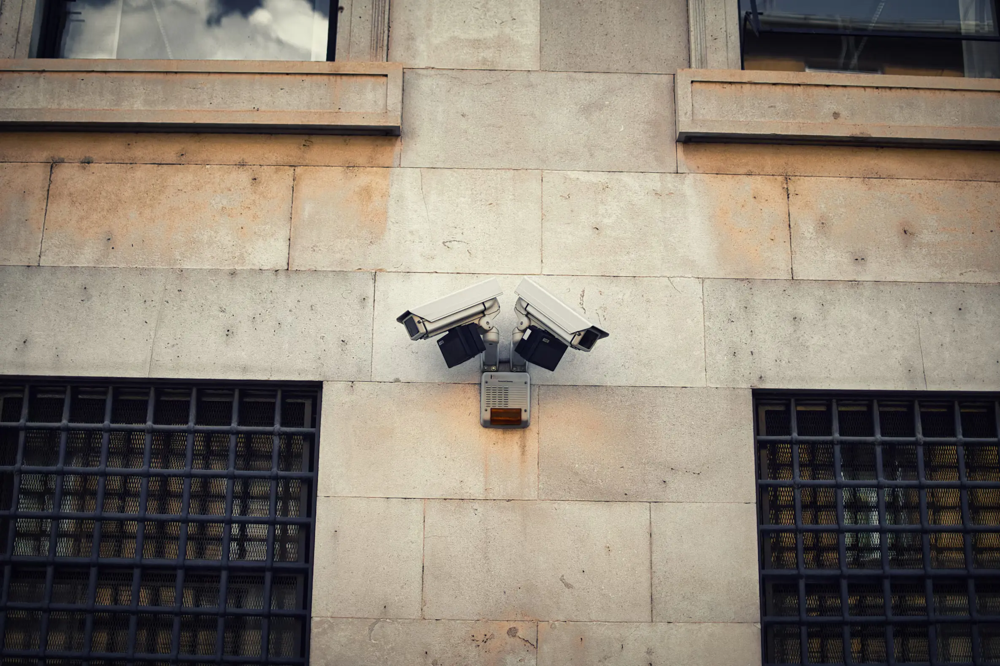
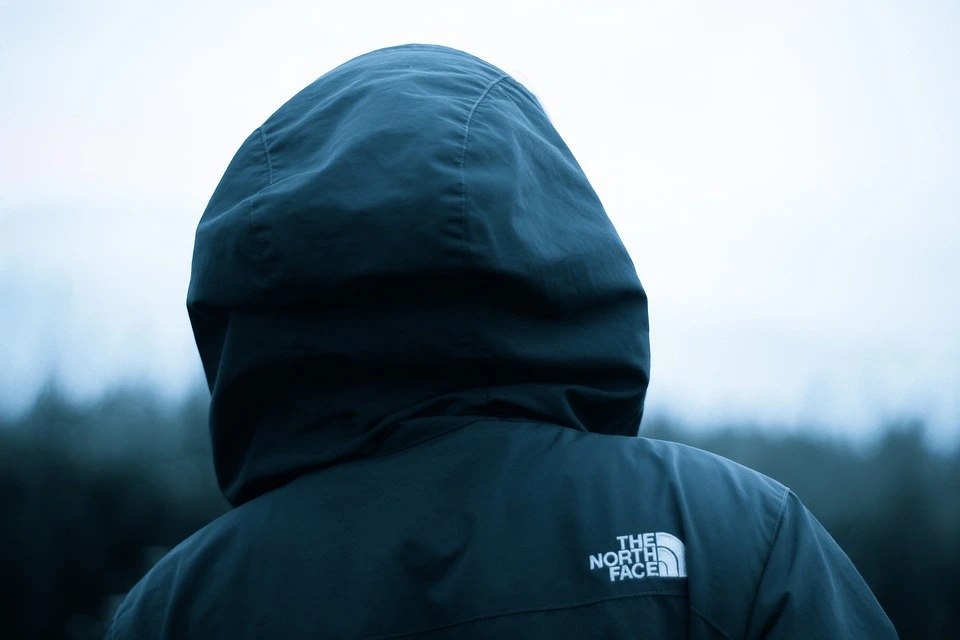

## Why Might You Want to Avoid Surveillance Cameras?

Surveillance cameras are increasingly present in public and private spaces. While their purpose is often linked to safety and security, many people have valid concerns about being constantly monitored. Here are some common motivations for avoiding these cameras:

- **Activists and Protesters**: Individuals advocating for social or political change often wish to protect their identities from authorities or opposing groups. They fear that being identified on camera could lead to harassment, retaliation, or suppression of their efforts.
  
- **Privacy Advocates**: In a world where personal data is increasingly tracked, some people value their anonymity and see surveillance as an infringement on their personal freedom. They take steps to avoid being captured on camera.

- **Whistleblowers and Journalists**: Individuals who expose corruption, misconduct, or sensitive information often need to protect their sources and themselves. Avoiding cameras is crucial to prevent being tracked down.

## Spotting Surveillance Cameras

Here are a few strategies for identifying cameras:

- **Check Common Locations**: Cameras are frequently placed in corners, above entrances, or near high-traffic areas.

- **Surveillance Camera Map**: Websites like [Surveillance under Surveillance](https://sunders.uber.space/){:target="_blank"} allow users to view known surveillance camera locations in their city. However, keep in mind that not all cameras are mapped.

## Counter-Surveillance Techniques

### Choosing Less Monitored Routes

One of the simplest strategies for avoiding cameras is to take alternative paths:

- **Plan Your Route**: When traveling, whether on foot or by vehicle, choose less monitored areas or routes with fewer cameras.

- **Use Natural Cover**: Parks, wooded areas, and alleyways can provide cover from surveillance cameras.

### Timing and Awareness

- **Move In Crowded Areas**: Walking in areas with heavy foot traffic can make it harder for cameras to single you out, as you'll blend into the crowd.

- **Avoid Looking**: Looking directly at a camera increases the chance of it capturing your whole face. "If you don’t see the camera, it won’t see you."

### Disguising Your Identity

If taking a different route isn't possible, there are practical ways to avoid being identified by surveillance cameras while blending in:

- **Baseball Caps and Hoodies**: A cap hides your forehead, and a hoodie covers your head and upper body. This combo works well year-round and helps you blend in.

- **Sunglasses**: Dark or mirrored sunglasses conceal your eyes, which are crucial for facial recognition systems. They’re ideal in sunny settings and don’t look out of place.

- **Masks**: Opt for face coverings like COVID-19 masks, which are now more widely accepted post-pandemic. These masks effectively hide the lower half of your face and blend in without attracting attention.

### Wi-Fi Jamming

Using a Wi-Fi jammer can disrupt the signals of Wi-Fi-based surveillance cameras, effectively blocking their communication. However, most street-level surveillance cameras are wired rather than wireless, so this method is often ineffective for public monitoring systems. Additionally, using jammers is illegal in many countries.


