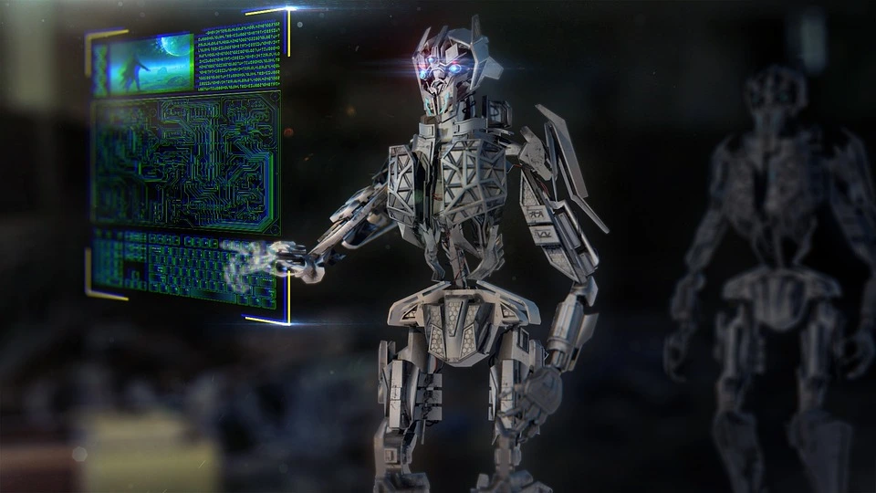

## Introduction
Artificial Intelligence (AI) has been around for over 60 years, but it has only recently begun to capture the public's attention. With the release of advanced AI models like ChatGPT, everybody and their grandma are increasingly aware of its potential impact on our lives and jobs.

## My Predictions
Here are some possible scenarious for how the future of AI may look like.

#### Scenario 1: AI to AGI to ASI
As AI continues to improve, we will eventually reach the stage of AGI (Artificial General Intelligence), where AI will have the ability to understand, learn, and apply knowledge across a wide range of tasks at a level equal to human capability. At this point, AGI will be able to replace jobs and take big decisions. When we surpass human intelligence with ASI (Artificial Super Intelligence), humans will be able to accomplish incredible things that are beyond our current comprehension.

#### Scenario 2: AI Will Make Us More Effective
In this scenario, AI will help us become more effective and productive in our personal and professional lives. AI-powered tools and systems will help us automate repetitive tasks, make better decisions, and even enhance our creativity. We will be able to achieve more in less time, and with less effort. We will need to find the right balance between using AI to enhance our abilities and using it to replace human judgment and creativity.

#### Scenario 3: AI Is Just Hype
On the other hand, it's possible that AI is just hype, and that it won't live up to the expectations that many people have for it. While AI has made significant progress in recent years, it's still a long way from being able to replicate human intelligence and decision-making abilities. In this scenario, AI will continue to be useful for certain tasks, but it won't replace any jobs. Instead, it will maybe create more jobs, just like the invention of the computer.

## Preparing For The Future
No matter what of these scenarious will happen in the future, AI will have a big impact on the job market and your everyday life. To ensure a positive outcome, it's best to start preparing now.

#### 1. Develop a Wide Skillset
To future-proof your career, develop a wide range of skills that are less likely to be replaced by AI. This will enable you to switch jobs and adapt to new technologies.

#### 2. Become Amish
If you're concerned about the impact of AI on your life, becoming Amish is an option to consider. The Amish community rejects modern technology and focuses on traditional skills and community building.

#### 3. Be Adaptable
Adaptability has always been crucial for the survival and advancement of humanity, and this is especially true in the age of modern technology. By embracing adaptability, you'll be better equipped to navigate the ever-changing landscape of AI and take advantage of the opportunities it presents. Stay up-to-date with the latest AI trends and technologies, and be open to learning new skills and adopting new ways of working.