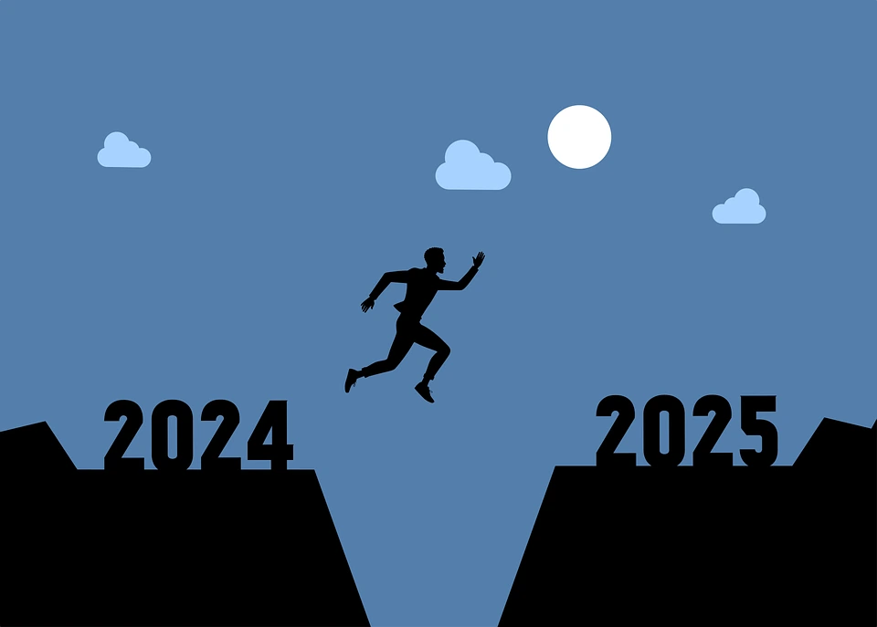

Welcome to my 2024 recap! In this post, I'll share all the things I have done in 2024 and my plans for the next year (2025) 😀

## Things I have done in 2024
##### My Coding Journey in 2024
The year 2024 was an exciting and productive one for me in terms of coding. To improve my coding skills and work on projects more frequently, I made some effort to dedicate time to code / work on a project almost daily. The countless hours of trial and error paid off, as I made good progress in my coding / problem-solving skills. However, I know that there is still much much more to learn and aim to continue learning and creating more projects. Here is a list of the different projects I completed in 2024, along with the duration of each project:
1. KnowYourTool (5 months)
2. All In One Productivity (1 month)
3. Typing Bot (2 days)
4. YouTube Automation Bot (2.5 weeks)
5. Human Benchmark (2 months)
6. whoareyou (3 days)

##### Taking My Privacy More Seriously
Half way through 2024 I started watching more YouTube videos on privacy and how big tech collects all your data. As a result, I made some changes to the way I use technology.

- I switched from Windows to Linux - I'd been using virtual machines for a while before switching, so the transition wasn't too difficult.
- I started using open-source alternatives to some of the apps I used to use.
- I started working more locally instead of in the cloud.

##### My Blog
I started this blog in the summer of 2024 and have written 23 posts so far (including this one). This blog covers a wide range of topics, from CTF write-ups to guides and explanations of different tech-related topics. Writing blog posts has been a rewarding experience, and I will happily be continuing.

##### My YouTube Channel
I launched a YouTube channel alongside my blog. However, I didn't post as many videos as I would have liked due to the time-consuming nature of video production. I discovered that I prefer writing blog posts over creating videos. For those interested in starting a YouTube channel, I recommend creating videos that are quick and easy to pump out, so you can learn the basics faster.

I may consider posting videos again in the future, but for now, I will focus on writing blog posts.

## Plans for 2025
In 2025, I aim to continue improving my coding skills and learning new technologies, while also reducing my reliance on AI to improve my problem-solving skills. I also plan to further educate myself on privacy, OpSec, and cybersecurity. As for my online presence, I will continue writing blog posts and try to post at least two or three per month.

## I'll see you in 2025 🥳🎆